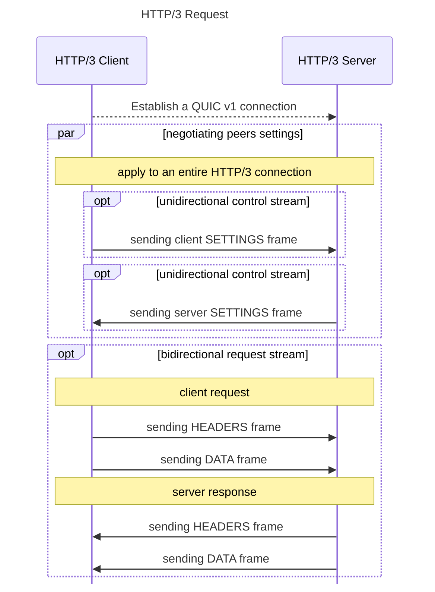

# Makes an HTTP/3 Request

To make an HTTP request following the HTTP/3 specification, several steps need to be completed between the client and server once a QUIC connection is established. The sequence diagram below illustrates how to send an HTTP request with the HTTP/3 specification to a server over a QUIC connection.

